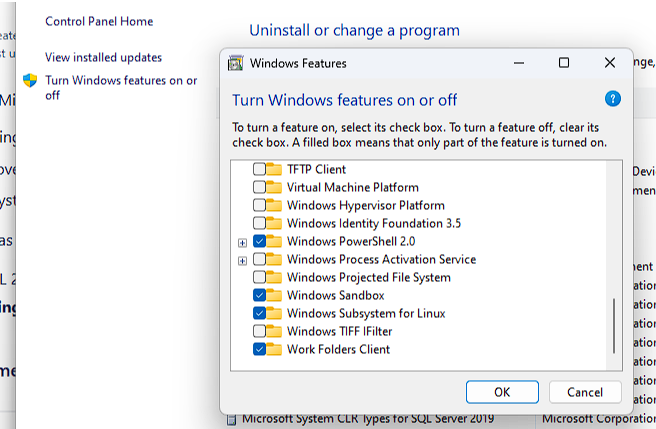
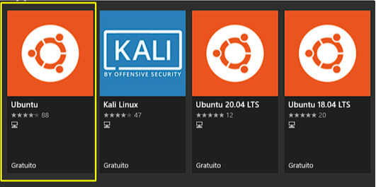

# Running native Docker on WSL2

## Installing and Configuring WSL2

Enable Windows Subsystem for Linux on Programs and Features panel.


windows + R, then appwiz.cpl to open Program and Features panel

## WSL Default Version

Updating from 1 to 2 is key to have everything you need working, run the following command:

```
wsl --set-default-version 2
```

## Installing Distro

Choose the Linux distribution in the [Windows Store app](https://www.microsoft.com/en-us/p/ubuntu/9nblggh4msv6#activetab=pivot:overviewtab), we suggest [Ubuntu](https://www.microsoft.com/en-us/p/ubuntu/9nblggh4msv6#activetab=pivot:overviewtab) as it is a popular distribution and comes with several tools installed by default.

Installation is pretty simple, click, choose a username and a password and wait for it to be finished. 



## WSL Configuration

To understand more about WSL configuration and `.wslconfig` and `wsl.conf` files go to [WSL Advanced Configuration](https://learn.microsoft.com/pt-br/windows/wsl/wsl-config#wsl-2-settings), basic stuff can be configured following the above settings.

### Latest Version

Make sure you’re using the latest version of WSL2. If not, run `wsl --update` to update your WSL version.


```
WSL version: 1.2.0.0
Kernel version: 5.15.90.1
WSLg version: 1.0.51
MSRDC version: 1.2.3770
Direct3D version: 1.608.2-61064218
DXCore version: 10.0.25131.1002-220531-1700.rs-onecore-base2-hyp
Windows version: 10.0.22621.1413
```

### System Usage Resources

If you want to limit the resources usage of your WSL, which can be high, create a file named `.wslconfig` in your user profile folder `(C:\users\your_username)` and configure was you wish.

Example:

```
[wsl2]
memory=8GB
processors=4
swap=2GB
```

### VPN, systemd, Snap and more native things

WSL now supports `systemd` which gives you `snap` and more native features. To enable this you need to configure the `wsl.conf` file at `/etc/wsl.conf` in your distro.

To enable `systemd` and `snap` add the following lines to your `wsl.conf`

```
[boot]
systemd=true
```

If you’re using VPN also add the following lines to stop `resolv.conf` from being generated, thus allowing you  to create your own DNS configuration. If you’re not using VPN you can skip this step.

```
[network]
generateResolvConf=false
```

If you added both, your `wsl.conf` should look like this

```
[boot]
systemd=true
[network]
generateResolvConf=false
```

Now restart the WSL using the command `wsl --shutdown` and open Ubuntu terminal again.

To get the DNS servers run `ipconfig /all` in your command prompt and find your VPN local entry with DNS Servers section and paste them in a new `/etc/resolv.conf` file that should look like this:

```
Description . . . . . . . . . . . : A Description
Physical Address. . . . . . . . . : XX-XX-XX-XX-XX-XX
DHCP Enabled. . . . . . . . . . . : No
Autoconfiguration Enabled . . . . : Yes
IPv6 Address. . . . . . . . . . . : xxxx:xxxx:xxxx:xxxx(Preferred)
Link-local IPv6 Address . . . . . : xxxx:xxxx:xxxx:xxxx(Preferred)
IPv4 Address. . . . . . . . . . . : 10.20.30.40(Preferred)
Subnet Mask . . . . . . . . . . . : 255.255.255.255
Default Gateway . . . . . . . . . : ::
                                    0.0.0.0
DHCPv6 IAID . . . . . . . . . . . :
DHCPv6 Client DUID. . . . . . . . : 
DNS Servers . . . . . . . . . . . : 123.45.67.89    <- Corporate DNS 1
                                    123.45.67.90    <- Corporate DNS 2
Primary WINS Server . . . . . . . : xxx.xx.xxx.xx
NetBIOS over Tcpip. . . . . . . . : Enabled
```

## Installing Docker

To install docker download the docker script from official website using curl to any folder.

```
curl -fsSL https://get.docker.com -o docker.sh
```

Then simply run the file

```
sh docker.sh
```

You can delete the file after installation.

After installing docker, add the user to docker group to make it easier to use docker commands without sudo.

```
sudo usermod -aG docker $USER
```

Check the version and if you see the version written on the screen, it’s done.

#### From inside ubuntu's prompt
```
docker -v
```

#### From the host machine
```
wsl docker -v
```

Either way the version should be

```
Docker version 23.0.3, build 3e7cbfd
```
